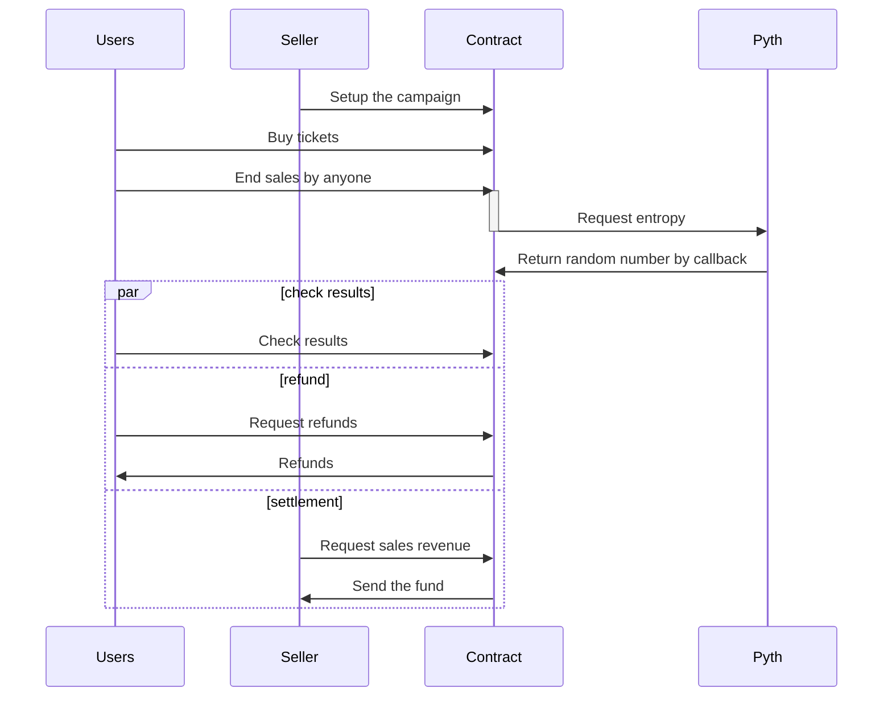

# Buenos Tickets

A fair ticket sales system built on blockchain, ensuring equal opportunity for all fans regardless of internet speed or reaction time.

## Background

This project was developed during **ETHGlobal Buenos Aires 2025** hackathon in Argentina, Buenos Aires.
- **Team**: 3 developers
- **Network**: Base Sepolia
- **License**: MIT (see [LICENSE](LICENSE) file)

### About the Name "Buenos Tickets"

The name "Buenos Tickets" reflects our mission to create **good (buenos)** and **fair** ticket sales. "Buenos" means "good" in Spanish, and we chose this name to emphasize our commitment to fairness and equal opportunity for all fans. Just as Buenos Aires is known for its vibrant culture and passion, we aim to bring fairness and transparency to ticket sales, ensuring that every fan has an equal chance regardless of technical advantages.

## Problem Statement

Imagine a famous tango performance in Buenos Aires. When ticket sales begin, thousands of fans rush to buy tickets, but they sell out in seconds. This creates an unfair advantage for those with:
- Faster internet connections
- Quicker reflexes
- Better timing

The traditional first-come, first-served (FCFS) system doesn't provide equal opportunity for all fans. It's not about passion or dedication—it's about technical advantages.

## Solution

Buenos Tickets implements a **fair ticket sales system** that ensures equal opportunity for everyone:

1. **Time Window**: Tickets are sold during a fixed time period (e.g., 10 minutes)
2. **Advance Payment**: Users pay in advance using USDC (ERC-20 token)
3. **Random Selection**: After the sales period ends, winners are selected using **Pyth Network Entropy** for provably fair randomness

### How It Works

```
1. Admin sets up the sale (duration, price, max tickets)
2. Users reserve tickets during the sales period
3. Sales period ends
4. If oversubscribed, request Pyth Network to generate random number. Everybody are chosen if undersubscribed.
5. Winners are chosen using the random number
6. Users who are not chosen can refund
```

## Example: Tango Ticket Sales in Buenos Aires
`
Let's say a famous tango show in Buenos Aires wants to sell 100 tickets:

1. **Setup**: The organizer sets up a sale for 10 minutes (600 blocks), price: 10 USDC per ticket, max: 100 tickets
2. **Sales Period**: During the 10-minute window, 500 fans connect their MetaMask wallets and reserve tickets by paying 10 USDC each
3. **Settlement**: After 10 minutes, the sale closes. Since 500 > 100, the contract requests a random number from Pyth Network
4. **Random Selection**: Using Pyth Network Entropy, 100 winners are selected fairly from the 500 participants
5. **Results**: 
   - 100 winners keep their tickets (10 USDC each = 1,000 USDC revenue)
   - 400 non-winners can claim refunds (400 × 10 USDC = 4,000 USDC refunded)
6. **Withdrawal**: The organizer withdraws the 1,000 USDC revenue

This ensures that every fan had an equal chance, regardless of when they clicked the button during the 10-minute window.

## Technology Stack

- **Smart Contracts**: Solidity ^0.8.0
- **Blockchain**: Base Sepolia
- **Randomness**: Pyth Network Entropy V2
- **Payment**: USDC (ERC-20 token)
- **Frontend**: HTML, CSS, JavaScript, ethers.js
- **Testing**: Hardhat

## Project Structure

```
monorepo/
├── contracts/
│   └── BuenosTickets/
│       ├── contracts/
│       │   ├── BuenosTickets.sol      # Main smart contract
│       │   ├── MockUSDC.sol           # Mock USDC for testing
│       │   └── *.t.sol                # Test files
│       └── hardhat.config.ts
├── frontend/
│   ├── index.html                     # Landing page
│   ├── customer.html                  # Customer interface
│   ├── merchant.html                  # Admin/Merchant interface
│   └── assets/
│       └── img/
│           └── tango-poster-generated-gemini-ai.png
└── LICENSE                            # MIT License
```

## Key Features

### Smart Contract Functions

**Admin Functions:**
- `setupSale`: Configure sale parameters (duration, price, max tickets)
- `settleSale`: Finalize the sale and request Pyth entropy if needed
- `spinWheel`: Select winners using Pyth Network random number
- `withdrawFunds`: Withdraw revenue from selected tickets
- `reset`: Reset contract state (Testing purpose)

**User Functions:**
- `reserveTicket`: Reserve a ticket by paying USDC
- `refund`: Claim refund if not selected
- `getSaleInfo`: View sale configuration and status
- `getUserStatus`: Check reservation status (Unreserved, Reserved, Selected, Refunded)

### Frontend Features

- **Customer Interface**: 
  - View event information
  - Reserve tickets
  - Check sale status
  - Claim refunds
  - View results with celebration animations

- **Merchant Interface**:
  - Setup ticket sales
  - Settle sales
  - Select winners
  - Withdraw funds
  - Reset contract

## Quick Start

### Prerequisites

- Node.js and npm
- MetaMask browser extension
- Base Sepolia testnet configured in MetaMask
- Test USDC tokens on Base Sepolia

### Running the Frontend

```bash
cd frontend
npx serve -p 8000
```

Then open:
- **Landing Page**: https://buenos-tickets.github.io/monorepo/
- **Customer Page**: https://buenos-tickets.github.io/monorepo/frontend/customer.html
- **Merchant Page**: https://buenos-tickets.github.io/monorepo/frontend/merchant.html

### Deploying Smart Contracts

```bash
cd contracts/BuenosTickets
npm install
npx hardhat compile
npx hardhat test
npx hardhat deploy --network baseSepolia
```

## Sequence Diagram



## Screenshots


## Future Work

- **x402 Payment Protocol**: Integration with Coinbase's CDP to enable gasless ticket payments via the x402 standard (planned, not yet implemented)

## AI Usage

This project used AI tools during development. Please see [AI_USAGE.md](AI_USAGE.md) for detailed information.

## License

This project is licensed under the MIT License - see the [LICENSE](LICENSE) file for details.

---

**Built with ❤️ during ETHGlobal Buenos Aires 2025**
