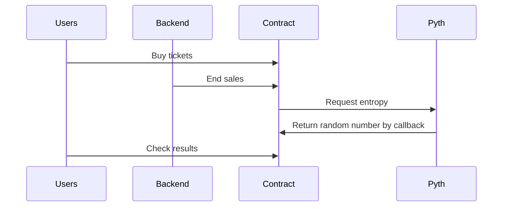

# buenos-tickets

We aim to make the ticket sales fair, not based on first-come, first-served basis.
Tickets will be sold until the closing time, after which a limited number of people will be selected.
Payment will be collected in advance, and refunds will be issued to those not selected.

## sequence diagram

